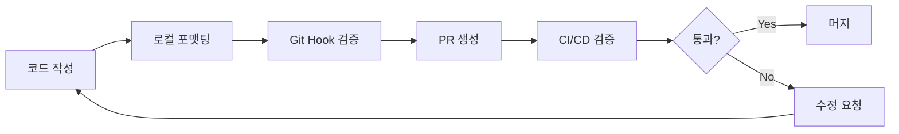

import { Tabs, TabItem } from '@astrojs/starlight/components';
import { Aside } from '@astrojs/starlight/components';
import { Code } from '@astrojs/starlight/components';

# Prettier: 팀 협업을 위한 코드 포맷팅 완벽 가이드

## 개요

Prettier는 opinionated code formatter로서, 개발 팀의 코드 스타일을 자동으로 통일시켜주는 강력한 도구입니다. 이 가이드는 Prettier를 효과적으로 도입하고 활용하기 위한 comprehensive approach를 제공합니다.

### 왜 Prettier인가?

개발 팀이 직면하는 주요 과제 중 하나는 일관된 코드 스타일 유지입니다. Prettier는 다음과 같은 이점을 제공합니다:

- **자동화된 일관성**: 모든 팀원의 코드가 동일한 스타일로 작성됨
- **코드 리뷰 효율성**: 스타일 논쟁 대신 로직에 집중
- **개발 생산성 향상**: 포맷팅에 신경 쓸 필요 없이 비즈니스 로직에 집중
- **신규 팀원 온보딩 간소화**: 별도의 스타일 가이드 학습 불필요

<Aside type="tip">
  Prettier는 ESLint와 달리 코드 품질이 아닌 코드 스타일에만 집중합니다. 두 도구를 함께 사용하면 코드 품질과 일관성을 모두 확보할 수 있습니다.
</Aside>

## 설치 및 초기 설정

### 1. 프로젝트 설치

<Tabs>
  <TabItem label="npm">
    ```bash
    npm install --save-dev prettier
    ```
  </TabItem>
  <TabItem label="Yarn">
    ```bash
    yarn add --dev prettier
    ```
  </TabItem>
  <TabItem label="pnpm">
    ```bash
    pnpm add -D prettier
    ```
  </TabItem>
</Tabs>

### 2. 설정 파일 구성

Prettier 설정은 프로젝트의 요구사항에 맞게 커스터마이징할 수 있습니다. 다음은 production-ready 설정 예시입니다:

<Code code={`{
  "printWidth": 100,
  "tabWidth": 2,
  "useTabs": false,
  "semi": true,
  "singleQuote": true,
  "quoteProps": "as-needed",
  "jsxSingleQuote": false,
  "trailingComma": "es5",
  "bracketSpacing": true,
  "bracketSameLine": false,
  "arrowParens": "always",
  "proseWrap": "preserve",
  "htmlWhitespaceSensitivity": "css",
  "endOfLine": "lf"
}`} lang="json" title=".prettierrc" />

#### 주요 설정 항목 상세 설명

| 설정 | 설명 | 권장 사항 |
|------|------|-----------|
| `printWidth` | 한 줄의 최대 길이 | 100-120 권장 (모니터 크기 고려) |
| `tabWidth` | 들여쓰기 너비 | 2 또는 4 (팀 규약 따름) |
| `semi` | 세미콜론 사용 여부 | `true` (명시적 종료 선호) |
| `singleQuote` | 작은따옴표 사용 | `true` (JavaScript 관례) |
| `trailingComma` | 후행 쉼표 | `es5` (git diff 최적화) |
| `arrowParens` | 화살표 함수 매개변수 괄호 | `always` (일관성) |
| `endOfLine` | 줄바꿈 문자 | `lf` (크로스 플랫폼 호환성) |

### 3. .prettierignore 설정

포맷팅을 제외할 파일들을 지정합니다:

<Code code={`# Dependencies
node_modules/
package-lock.json
yarn.lock
pnpm-lock.yaml

# Production builds
dist/
build/
.next/
out/

# Version control
.git/

# Environment files
.env*

# Generated files
*.min.js
*.min.css
coverage/
*.generated.*

# Documentation
*.md
docs/`} lang="gitignore" title=".prettierignore" />

## IDE 통합

### Visual Studio Code 설정

VS Code에서 Prettier를 최대한 활용하기 위한 설정입니다:

<Code code={`{
  // Prettier를 기본 포맷터로 설정
  "editor.defaultFormatter": "esbenp.prettier-vscode",
  
  // 저장 시 자동 포맷팅
  "editor.formatOnSave": true,
  
  // 붙여넣기 시 포맷팅 (선택사항)
  "editor.formatOnPaste": false,
  
  // 파일별 설정
  "[javascript]": {
    "editor.defaultFormatter": "esbenp.prettier-vscode"
  },
  "[typescript]": {
    "editor.defaultFormatter": "esbenp.prettier-vscode"
  },
  "[json]": {
    "editor.defaultFormatter": "esbenp.prettier-vscode"
  },
  
  // Prettier 설정 파일 자동 감지
  "prettier.requireConfig": true
}`} lang="json" title=".vscode/settings.json" />

<Aside type="danger">
  `prettier.requireConfig: true` 설정은 Prettier 설정 파일이 없는 프로젝트에서는 포맷팅을 실행하지 않습니다. 이는 의도치 않은 포맷팅을 방지합니다.
</Aside>

### IntelliJ IDEA / WebStorm 설정

1. **File > Settings > Plugins**에서 Prettier 플러그인 설치
2. **Settings > Languages & Frameworks > JavaScript > Prettier** 설정:
   - Prettier package 경로 지정
   - "On save" 옵션 활성화
   - File pattern 설정: `{**/*,*}.{js,ts,jsx,tsx,vue,json,css,scss,html}`

## 팀 협업 전략

### 1. Git Hooks를 통한 자동화

코드 품질을 보장하기 위해 commit 전 자동 검사를 설정합니다:

<Tabs>
  <TabItem label="husky + lint-staged">
    ```bash
    npm install --save-dev husky lint-staged
    npx husky init
    echo "npx lint-staged" > .husky/pre-commit
    ```

    > **참고**: 위 명령어는 Husky v9+ 기준이다. Husky v8 이하에서는 `npx husky install` 및 `npx husky add`를 사용했으나 현재는 deprecated 되었다.
    
    <Code code={`{
  "scripts": {
    "prepare": "husky"
  },
  "lint-staged": {
    "*.{js,jsx,ts,tsx}": [
      "prettier --write",
      "eslint --fix"
    ],
    "*.{json,css,scss,md}": [
      "prettier --write"
    ]
  }
}`} lang="json" title="package.json" />
  </TabItem>
  <TabItem label="simple-git-hooks">
    ```bash
    npm install --save-dev simple-git-hooks lint-staged
    ```
    
    <Code code={`{
  "simple-git-hooks": {
    "pre-commit": "npx lint-staged"
  },
  "lint-staged": {
    "*.{js,jsx,ts,tsx,json,css,md}": "prettier --write"
  }
}`} lang="json" title="package.json" />
  </TabItem>
</Tabs>

### 2. CI/CD 파이프라인 통합

<Code code={`name: Code Quality Check

on:
  pull_request:
    branches: [ main, develop ]

jobs:
  prettier:
    runs-on: ubuntu-latest
    steps:
      - uses: actions/checkout@v3
      - uses: actions/setup-node@v3
        with:
          node-version: '18'
          cache: 'npm'
      
      - name: Install dependencies
        run: npm ci
      
      - name: Check Prettier formatting
        run: npm run prettier:check
      
      - name: Annotate diff
        if: failure()
        run: |
          npm run prettier:write
          git diff --exit-code || echo "::error::Code formatting issues found. Run 'npm run prettier:write' locally."`} lang="yaml" title=".github/workflows/prettier.yml" />

### 3. NPM Scripts 설정

<Code code={`{
  "scripts": {
    "prettier:check": "prettier --check .",
    "prettier:write": "prettier --write .",
    "prettier:debug": "prettier --check --log-level debug .",
    "format": "npm run prettier:write",
    "format:staged": "lint-staged"
  }
}`} lang="json" title="package.json" />

## 고급 설정

### 1. 파일별 설정 오버라이드

특정 파일이나 디렉토리에 다른 설정을 적용할 수 있습니다:

<Code code={`{
  "semi": true,
  "singleQuote": true,
  "overrides": [
    {
      "files": "*.test.js",
      "options": {
        "printWidth": 120
      }
    },
    {
      "files": ["*.json", ".prettierrc"],
      "options": {
        "tabWidth": 2
      }
    },
    {
      "files": "*.md",
      "options": {
        "proseWrap": "always",
        "printWidth": 80
      }
    }
  ]
}`} lang="json" title=".prettierrc" />

### 2. ESLint와의 통합

Prettier와 ESLint를 함께 사용할 때 충돌을 방지하는 설정:

```bash
npm install --save-dev eslint-config-prettier eslint-plugin-prettier
```

<Code code={`{
  "extends": [
    "eslint:recommended",
    "plugin:prettier/recommended"  // 항상 마지막에 위치
  ],
  "rules": {
    "prettier/prettier": ["error", {
      "endOfLine": "auto"  // Windows 환경 대응
    }]
  }
}`} lang="json" title=".eslintrc.json" />

## 문제 해결 가이드

### 자주 발생하는 문제와 해결 방법

#### 1. Line ending 문제 (CRLF vs LF)

<Aside type="caution">
  Windows와 Unix 시스템 간 협업 시 줄바꿈 문자 차이로 인한 문제가 발생할 수 있습니다.
</Aside>

**해결 방법:**
```bash
# Git 설정
git config --global core.autocrlf true  # Windows
git config --global core.autocrlf input # Mac/Linux

# .gitattributes 파일 생성
echo "* text=auto eol=lf" > .gitattributes
```

#### 2. 포맷팅 충돌

다른 포맷터나 ESLint 규칙과 충돌하는 경우:

```javascript
// ESLint 규칙 비활성화 예시
/* eslint-disable prettier/prettier */
const complexObject = {
  // 특별한 포맷팅이 필요한 코드
};
/* eslint-enable prettier/prettier */

// Prettier 비활성화
// prettier-ignore
const matrix = [
  [1, 0, 0],
  [0, 1, 0],
  [0, 0, 1]
];
```

#### 3. 성능 최적화

대규모 프로젝트에서 Prettier 성능 개선:

```bash
# 캐시 활용
prettier --cache --write .

# 병렬 처리 (prettier-parallel)
npm install --save-dev prettier-parallel
prettier-parallel "src/**/*.{js,jsx,ts,tsx}"
```

## Best Practices

### 1. 팀 도입 전략

1. **점진적 도입**: 새로운 파일부터 적용하고 기존 파일은 단계적으로 마이그레이션
2. **팀 합의**: 주요 설정 항목에 대한 팀원 간 합의 도출
3. **문서화**: 프로젝트별 Prettier 사용 가이드 작성
4. **교육**: 팀원들에게 Prettier의 이점과 사용법 교육

### 2. 유지보수 가이드라인

- Prettier 버전을 `package.json`에 고정하여 일관성 유지
- 설정 변경 시 전체 코드베이스 재포맷팅 고려
- 정기적인 Prettier 업데이트 및 변경사항 검토

### 3. 모니터링 및 개선



## 결론

Prettier는 단순한 코드 포맷터를 넘어 팀의 개발 효율성을 크게 향상시키는 필수 도구입니다. 올바른 설정과 워크플로우 통합을 통해 코드 품질과 일관성을 자동으로 보장할 수 있습니다.

<Aside type="note">
  **다음 단계**: 
  1. 프로젝트에 Prettier 설치 및 설정
  2. 팀원들과 설정 옵션 논의 및 합의
  3. Git hooks와 CI/CD 파이프라인 설정
  4. 팀 위키에 프로젝트별 가이드 문서화
</Aside>