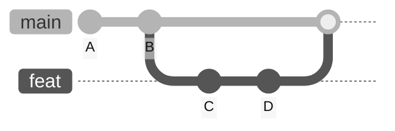
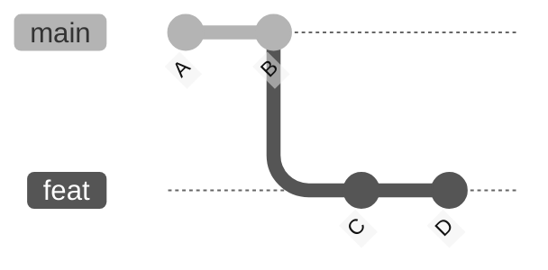
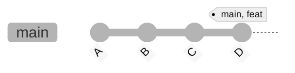
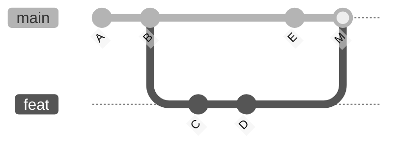
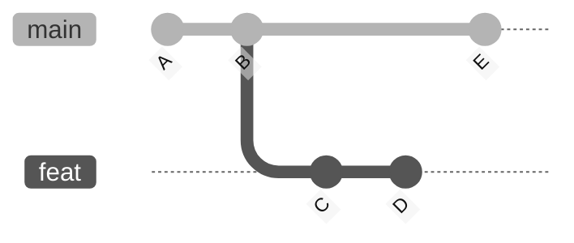
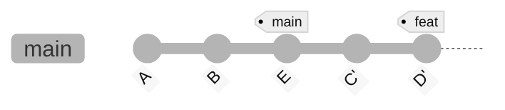

import { Aside, FileTree, Tabs, TabItem } from '@astrojs/starlight/components';
import SampBox from '../../../../components/SampBox.astro';

## 선수 지식

본 문서를 효과적으로 이해하기 위해서는 다음 개념에 대한 기본적인 이해가 필요하다:

- Git의 커밋(commit)과 브랜치(branch) 개념
- HEAD와 브랜치 포인터의 동작 방식
- Git의 기본 명령어 (checkout, commit, merge)
- 커밋 그래프와 DAG(Directed Acyclic Graph) 구조

위 개념들에 익숙하지 않다면 Git 기초 문서를 먼저 참고하기 바란다.

<Aside>

<Tabs>

    <TabItem label="`main` 브랜치">
    <FileTree>
    - .git/ → Git 저장소 디렉토리
    - file_A.txt
    - file_B.txt
    </FileTree>
    </TabItem>
    
    <TabItem label="`feat` 브랜치">
    <FileTree>
    - .git/ → Git 저장소 디렉토리
    - file_A.txt
    - file_B.txt
    - file_C.txt
    - file_D.txt
    </FileTree>
    </TabItem>

</Tabs>

```shell
# 저장소 초기화 및 기본 커밋 생성
git init
echo "Initial content" > file.txt
git add file.txt
git commit -m "Initial commit"

# feat 브랜치 생성 및 작업
git checkout -b feat
echo "Feature work" >> file.txt
git add file.txt
git commit -m "Add feature"
```
</Aside>

## Ⅰ. Git 병합의 본질과 내부 동작

### 1.1 병합이란 무엇인가

Git에서 병합(merge)은 두 개 이상의 개발 히스토리를 하나로 통합하는 과정이다. 기술적으로는 서로 다른 커밋 트리를 결합하여 새로운 커밋 트리를 생성하는 작업이다.



### 1.2 병합의 내부 메커니즘

Git은 병합 시 다음 단계를 거친다:

1. **공통 조상(Merge Base) 찾기**: 두 브랜치의 가장 최근 공통 조상 커밋을 찾는다.
2. **3-way Merge 수행**: 공통 조상, 현재 브랜치, 병합 대상 브랜치의 스냅샷을 비교한다.
3. **병합 결과 생성**: 변경사항을 통합하여 새로운 트리 객체를 생성한다.
4. **커밋 생성**: 병합 결과를 담은 새 커밋을 생성한다.

## Ⅱ. Fast-forward 병합

### 2.1 개념과 동작 원리

Fast-forward 병합은 현재 브랜치가 병합 대상 브랜치의 직접적인 조상일 때 발생한다. 이 경우 Git은 단순히 브랜치 포인터를 앞으로 이동시킨다.



위 상황에서 main 브랜치를 feat로 병합하면:



### 2.2 실습 예제

```bash
# main으로 돌아가서 병합
git checkout main
git merge feat

# 결과 확인
git log --oneline --graph
```

<SampBox summary="출력 예시">
{`
*   3f4e5d6 (HEAD -> main, feat) Add feature
*   1a2b3c4 Initial commit
`}
</SampBox>

### 2.3 Fast-forward 병합의 특징

**장점:**
- 선형적인 히스토리 유지
- 병합 커밋이 생성되지 않아 히스토리가 단순함
- 충돌 가능성이 없음

**단점:**
- 병합 시점과 브랜치 경계가 히스토리에 남지 않음
- 기능 개발의 논리적 단위가 불명확해질 수 있음

## Ⅲ. 3-way Merge (True Merge)

### 3.1 개념과 동작 원리

3-way merge는 두 브랜치가 서로 독립적인 커밋을 가질 때 수행된다. Git은 공통 조상과 두 브랜치의 최신 커밋을 비교하여 병합한다.



### 3.2 실습 예제

```bash
# 저장소 초기화
git init
echo "Initial content" > file.txt
git add file.txt
git commit -m "Initial commit"

# feat 브랜치에서 작업
git checkout -b feat
echo "Feature line" >> feature.txt
git add feature.txt
git commit -m "Add feature"

# main 브랜치에서 독립적인 작업
git checkout main
echo "Main line" >> main.txt
git add main.txt
git commit -m "Add main work"

# 병합 수행
git merge feat -m "Merge \`feat\` branch"

# 결과 확인
git log --oneline --graph --all
```

<SampBox summary="출력 예시">
{`
*   5f6g7h8 (HEAD -> main) Merge \`feat\` branch
|\\
| * 3d4e5f6 (feat) Add feature
* | 1c2d3e4 Add main work
*/  
* 9a8b7c6 Initial commit
`}
</SampBox>

### 3.3 병합 커밋의 구조

병합 커밋은 두 개의 부모 커밋을 가진다:

```bash
# 병합 커밋의 상세 정보 확인
git cat-file -p HEAD
```

<SampBox summary="출력 예시">
{`
tree 4b825dc642cb6eb9a060e54bf8d69288fbee4904
parent 1c2d3e4... (첫 번째 부모 - 현재 브랜치)
parent 3d4e5f6... (두 번째 부모 - 병합된 브랜치)
author John Doe \<john@example.com> 1234567890 +0000
committer John Doe \<john@example.com> 1234567890 +0000

Merge \`feat\` branch
`}
</SampBox>

## Ⅳ. Rebase를 통한 히스토리 재구성

### 4.1 개념과 동작 원리

Rebase는 커밋들을 다른 베이스 위로 재적용하여 선형적인 히스토리를 만든다. 기술적으로는 각 커밋의 패치를 추출하여 새로운 베이스에 순차적으로 적용한다.



Rebase 후:



### 4.2 실습 예제

```bash
# 초기 설정
git init
echo "Base content" > file.txt
git add file.txt
git commit -m "Base commit"

# feat 브랜치 작업
git checkout -b feat
echo "Feature 1" >> file.txt
git add file.txt
git commit -m "Feature commit 1"
echo "Feature 2" >> file.txt
git add file.txt
git commit -m "Feature commit 2"

# main 브랜치 작업
git checkout main
echo "Main work" > main.txt
git add main.txt
git commit -m "Main commit"

# Rebase 수행
git checkout feat
git rebase main

# 결과 확인
git log --oneline --graph --all
```

<SampBox summary="로그 출력 예시">
{`
* 7h8i9j0 (HEAD -> feat) Feature commit 2
* 5f6g7h8 Feature commit 1
* 3d4e5f6 (main) Main commit
* 1a2b3c4 Base commit
`}
</SampBox>

### 4.3 Rebase 중 충돌 처리

```bash
# 충돌 발생 시
git rebase main
```

<SampBox summary="출력 예시">
{`
CONFLICT (content): Merge conflict in file.txt
error: could not apply 5f6g7h8... Feature commit 1
hint: Resolve all conflicts manually, mark them as resolved with
hint: "git add/rm \<conflicted_files>", then run "git rebase --continue".
`}
</SampBox>

```bash
# 충돌 해결
# 1. 파일 편집하여 충돌 해결
# 2. 스테이징
git add file.txt
# 3. Rebase 계속
git rebase --continue
```

## Ⅴ. 병합 전략 설정과 옵션

### 5.1 Fast-forward 제어

```bash
# Fast-forward 금지 (항상 병합 커밋 생성)
git merge --no-ff feat

# Fast-forward만 허용
git merge --ff-only feat

# 전역 설정
git config merge.ff false  # 항상 병합 커밋 생성
```

### 5.2 병합 전략 지정

```bash
# ort (기본값, Git 2.33+) - 대부분의 경우에 적합
git merge -s ort feat

# Ours - 현재 브랜치의 내용만 유지
git merge -s ours feat

# Octopus - 3개 이상의 브랜치 병합
git merge branch1 branch2 branch3
```

## Ⅵ. 고급 시나리오와 실무 패턴

### 6.1 Feature Branch 워크플로우

```bash
# 기능 개발 시작
git checkout -b feat/user-authentication
# ... 개발 작업 ...

# main의 최신 변경사항 통합
git checkout main
git pull origin main
git checkout feat/user-authentication
git rebase main  # 또는 merge main

# 개발 완료 후 병합
git checkout main
git merge --no-ff feat/user-authentication
```

### 6.2 병합 중단과 되돌리기

```shell
# 병합 중단
git merge --abort

# 병합 커밋 되돌리기
git revert -m 1 HEAD  # -m 1은 첫 번째 부모로 되돌림
```

### 6.3 Cherry-pick을 통한 선택적 병합

```shell frame="none"
# 특정 커밋만 가져오기
git cherry-pick <commit-hash>

# 범위로 가져오기
git cherry-pick <start-commit>..<end-commit>
```

## Ⅶ. 병합 전략 선택 가이드

### 7.1 상황별 권장 전략

| 상황 | 권장 전략 | 이유 |
|:----|:--------|:----|
| 개인 기능 브랜치 | Rebase | 깔끔한 히스토리 유지 |
| 공개된 브랜치 | Merge (`--no-ff`) | 히스토리 보존, 협업 안정성 |
| 핫픽스 | Fast-forward | 신속한 적용 |
| 릴리즈 브랜치 | Merge (`--no-ff`) | 릴리즈 경계 명확화 |

### 7.2 팀 정책 수립 시 고려사항

1. **히스토리 가독성**: 프로젝트 규모와 팀 크기에 따라 결정
2. **협업 패턴**: 동시 작업이 많다면 merge 선호
3. **배포 주기**: 자주 배포한다면 명확한 병합 지점 필요
4. **롤백 용이성**: 병합 커밋이 있으면 되돌리기 수월

## Ⅷ. 문제 해결과 디버깅

### 8.1 병합 충돌 분석

```bash
# 충돌 파일 확인
git status
```

<SampBox summary="출력 예시" code={`
On branch main
You have unmerged paths.
  (fix conflicts and run "git commit")
  (use "git merge --abort" to abort the merge)

Unmerged paths:
  (use "git add \<file>..." to mark resolution)
	both modified:   file.txt
`}/>

<SampBox>
{`
On branch main
You have unmerged paths.
  (fix conflicts and run "git commit")
  (use "git merge --abort" to abort the merge)

Unmerged paths:
  (use "git add <file>..." to mark resolution)
	both modified:   file.txt
`}
</SampBox>

```bash
# 3-way diff 보기
git diff --cc

# 병합 도구 사용
git mergetool
```

### 8.2 잘못된 병합 복구

```bash
# reflog를 통한 이전 상태 확인
git reflog
```

<SampBox collapsible summary="출력 예시">
{`
3f4e5d6 (HEAD -> main) HEAD@{0}: merge feat: Merge made by recursive strategy.
1a2b3c4 HEAD@{1}: checkout: moving from feat to main
9z8y7x6 HEAD@{2}: commit: Add feat
`}
</SampBox>

```bash
# 특정 지점으로 리셋
git reset --hard HEAD@{1}
```

## 참고 자료

- [Git 설정 계층 구조 문서](./git-configuration-layers.md)
- [Git 내부 구조 문서](./git-internals.md)
- Pro Git Book - Chapter 3: Git Branching