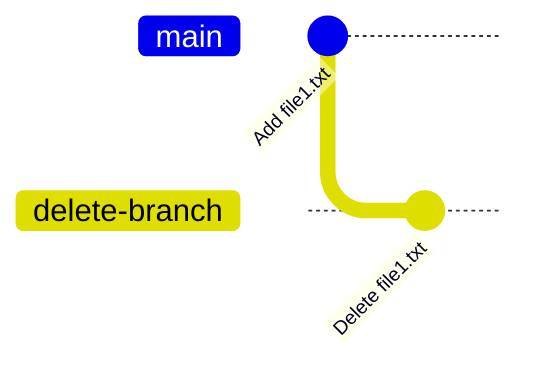
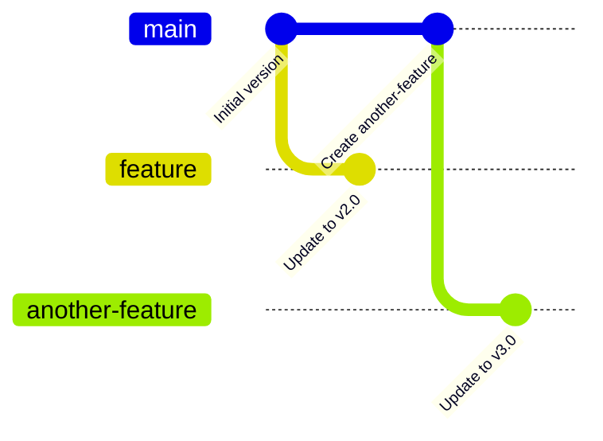
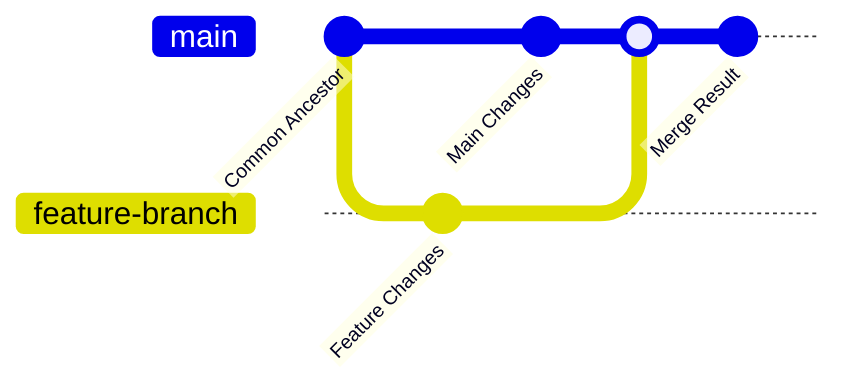
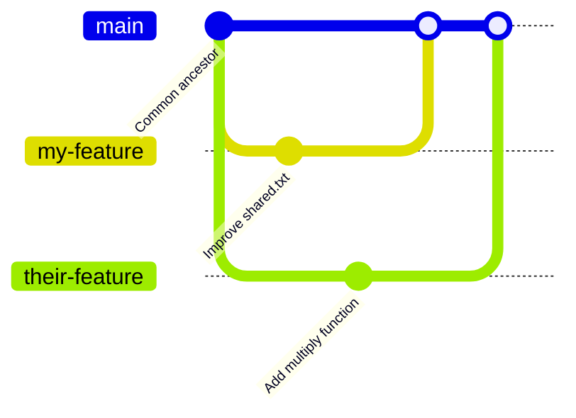
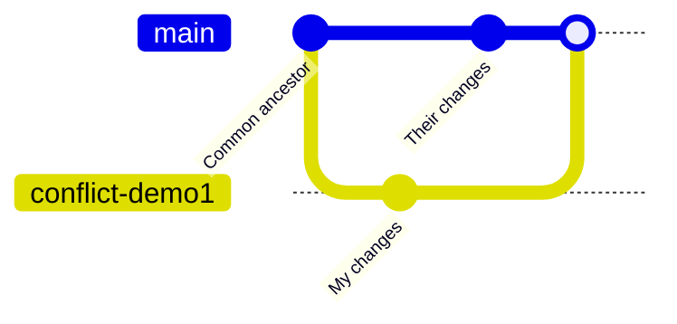

> 이 문서는 Git 공식 문서 [trivial-merge](https://git-scm.com/docs/trivial-merge)의 완전한 해설입니다. read-tree 명령어에서 사용되는 trivial merge 로직의 모든 케이스를 자연어로 해석하여 깊이 있게 이해할 수 있도록 구성했습니다.

## 기초 개념

> ***Git에서 "트리"와 "인덱스"란 무엇인가?***

### 트리(Tree) 개념 이해하기

Git에서 "트리"는 특정 시점의 전체 프로젝트 상태를 나타내는 스냅샷입니다. 마치 사진 한 장처럼, 그 순간 모든 파일과 디렉토리의 구조와 내용을 완전히 기록합니다.

구체적으로 생각해보면, 여러분의 프로젝트 폴더를 지금 당장 복사해서 다른 곳에 저장해둔다고 상상해보세요. 그 복사본이 바로 "트리"의 개념과 같습니다. 파일 이름, 디렉토리 구조, 각 파일의 내용, 권한 등이 모두 포함됩니다.

```
예시 트리:
📁 my-project/
├── 📄 README.md      (내용: "프로젝트 소개")
├── 📄 package.json   (내용: {"name": "my-app"})
├── 📁 src/
│   ├── 📄 main.js    (내용: "console.log('hello')")
│   └── 📄 utils.js   (내용: "export function add(a,b) {...}")
└── 📁 docs/
    └── 📄 api.md     (내용: "API 문서")
```

Git은 커밋할 때마다 이런 트리를 하나씩 생성하여 저장합니다. 브랜치를 바꾸거나 merge를 할 때는 서로 다른 트리들을 비교하고 통합하는 작업을 수행합니다.

### 인덱스(Index) 개념 이해하기

인덱스는 Git의 "작업대"라고 생각하면 됩니다. 여러분이 `git add`로 파일을 staging할 때, 그 파일들이 임시로 준비되는 공간이 바로 인덱스입니다.

하지만 인덱스의 역할은 단순한 staging area를 넘어섭니다. Merge 작업 중에는 여러 트리의 내용을 비교하고 통합하는 "작업 공간"으로 변신합니다. 

**인덱스의 이중적 성격:**
- **개념적 측면**: 특정 시점의 프로젝트 상태를 나타냄 (트리와 유사)
- **기능적 측면**: 파일들을 임시로 보관하고 조작하는 작업 공간

이 문서에서 "인덱스의 상태"라고 표현할 때는 개념적 측면을, "인덱스에서 파일을 제거한다"라고 표현할 때는 기능적 측면을 의미합니다.

## 서론: Trivial Merge란 무엇인가?

Trivial merge는 Git이 자동으로 안전하게 처리할 수 있는 "간단한" 상황들을 정의한 규칙 체계입니다. 여기서 주의해야 할 점은 이름에 "merge"가 들어가지만, 실제로는 **트리 상태 변경 시 안전성을 보장하는 더 넓은 개념**이라는 것입니다.

### "Merge"라는 용어에 대한 중요한 이해

일반적으로 우리가 "merge"라고 생각하는 것은 `git merge` 명령어를 통해 두 브랜치를 합치는 작업입니다. 하지만 trivial-merge 문서에서 다루는 "merge"는 더 넓은 의미를 가집니다. 이는 실제로 `git merge`, `git pull`, `git checkout`, `git reset` 등 다양한 고수준 명령어들이 내부적으로 호출하는 `read-tree` 명령어에서 구현되는 핵심 로직입니다.

예를 들어, `git checkout`으로 브랜치를 전환할 때도 trivial-merge 로직이 작동합니다. 이는 엄밀히 말해 "병합"이 아니라 "동기화"이지만, 내부적으로는 같은 안전장치 메커니즘을 사용합니다. 사용자가 수정한 파일이 있을 때 "Your local changes would be overwritten"라는 에러가 나오는 것이 바로 이 로직의 결과입니다.

따라서 trivial-merge는 "간단한 병합"이라기보다는 **"트리 상태 변경 시 사용자 작업을 보호하면서 안전하게 처리할 수 있는 상황들의 분류 체계"**라고 이해하는 것이 더 정확합니다.

### 핵심 설계 철학

모든 trivial-merge 로직의 근간은 **데이터 손실 방지**입니다. Git은 사용자의 작업을 실수로 덮어쓰는 것을 극도로 경계하며, 모든 자동 처리는 "100% 안전하다고 확신할 수 있는 경우"에만 수행됩니다. 이런 보수적인 접근이 때로는 번거로울 수 있지만, 협업 환경에서 데이터 무결성을 보장하는 Git의 핵심 강점이기도 합니다.

---

## 1. One-way Merge: 단순 교체

### 개념
One-way merge는 가장 단순한 형태로, 현재 index를 완전히 다른 트리로 교체하는 작업입니다. 비교나 충돌 해결 과정이 없으며, 단순히 A 상태를 B 상태로 바꾸는 것입니다.

### 테이블 해석

```
index    tree     result
-----------------------
*        (empty)  (empty)
tree     tree     index+
index+   index+   index+
```

**칼럼 설명:**
- **index**: 현재 인덱스에 있는 파일의 상태
- **tree**: 목표가 되는 트리 객체에서 해당 파일의 상태  
- **result**: 작업 완료 후 인덱스가 가져야 할 파일 상태

**값의 의미:**
- **`*`**: 어떤 상태든 관계없음 (와일드카드)
- **`(empty)`**: 해당 파일이 존재하지 않는 상태
- **`tree`**: 트리 객체의 파일 내용과 동일한 상태
- **`index+`**: 인덱스에 있던 파일 내용을 유지하되, stat 정보(파일 수정시간, 크기 등)도 보존

**자연어 해석:**

**첫 번째 케이스:** "인덱스에 파일이 있든 없든, 목표 트리에 해당 파일이 없다면, 결과적으로 인덱스에서도 해당 파일을 없는 상태로 만든다"

**두 번째 케이스:** "인덱스의 파일 내용과 목표 트리의 파일 내용이 동일하다면, 인덱스의 stat 정보를 보존하면서 그 상태를 유지한다"

**세 번째 케이스:** "인덱스에 이미 올바른 내용과 stat 정보가 있다면, 변경할 필요가 없으므로 그 상태를 유지한다"

### 실습: One-way Merge 체험하기

One-way merge의 동작을 직접 체험해보겠습니다. 이 실습에서는 브랜치 전환(checkout) 과정에서 trivial-merge 로직이 어떻게 작동하는지 확인할 수 있습니다.

실습에서 만들어질 브랜치 구조를 먼저 시각적으로 살펴보겠습니다.



이 구조에서 main 브랜치에는 file1.txt가 있지만, delete-branch에서는 이 파일이 삭제되었습니다. main에서 delete-branch로 checkout할 때 One-way merge 로직이 "file1.txt를 working directory에서 제거해야 한다"고 판단하게 됩니다. 하지만 만약 사용자가 file1.txt를 수정해두었다면, 안전장치가 작동하여 checkout을 거부할 것입니다.

다음 코드로 One-way merge의 동작을 직접 체험해볼 수 있습니다.

```bash
# 실습 환경 준비
mkdir trivial-merge-demo && cd trivial-merge-demo
git init

# 첫 번째 케이스 (파일 삭제) 실습
echo "hello world" > file1.txt
git add file1.txt
git commit -m "Add file1.txt"

# 다른 브랜치에서 파일 삭제
git checkout -b delete-branch
git rm file1.txt
git commit -m "Delete file1.txt"

# 원래 브랜치로 돌아가서 one-way merge 관찰
git checkout main
echo "modified" > file1.txt
git add file1.txt
# 이 상태에서 delete-branch로 체크아웃하면 one-way merge 발생
git checkout delete-branch
# file1.txt가 사라진 것을 확인
ls
```

### 실제 사용 예시
- `git checkout <branch>`: 다른 브랜치로 전환
- `git reset --hard <commit>`: 특정 커밋 상태로 강제 이동

---

## 2. Two-way Merge: 변화 추적 기반 안전 병합

### 개념
Two-way merge는 "이전 상태(old)"에서 "새로운 상태(new)"로의 변화를 추적하면서, 현재 index 상태가 안전하게 업데이트될 수 있는지 판단합니다. 핵심은 사용자가 작업 중인 내용을 보호하는 것입니다.

### 안전 규칙
- **Index가 없어도 됨**: 해당 파일이 staging area에 없다고 해서 merge가 불가능한 것은 아닙니다
- **Index가 있다면 반드시 검증**: index에 파일이 있다면, 그 내용이 old 버전이나 예상되는 result와 일치해야 합니다. 그렇지 않으면 사용자의 작업이 손실될 위험이 있으므로 에러를 발생시킵니다

### 테이블 해석

```
case  index   old    new     result
------------------------------------- 
0/2   (empty) *      (empty) (empty)
1/3   (empty) *      new     new
4/5   index+  (empty)(empty) index+
6/7   index+  (empty)index   index+
10    index+  index  (empty) (empty)
14/15 index+  old    old     index+
18/19 index+  old    index   index+
20    index+  index  new     new
```

**칼럼 설명:**
- **case**: 케이스 번호 (여러 케이스가 같은 패턴을 가질 수 있어 슬래시로 구분)
- **index**: 현재 staging area의 상태
- **old**: 이전 버전의 상태
- **new**: 새로운 버전의 상태
- **result**: 병합 결과로 index가 가져야 할 상태

**주요 케이스별 자연어 해석:**

**Case 0/2:** "index에 파일이 없고, 새 버전에도 파일이 없다면, 결과적으로 파일이 없는 상태를 유지한다. 이전 버전의 상태는 무관하다."

**Case 1/3:** "index에 파일이 없지만 새 버전에는 파일이 있다면, 새 파일을 추가한다. 이는 새로운 파일의 생성을 의미한다."

**Case 4/5:** "index에 파일이 있는데 이전과 새 버전 모두에 파일이 없다면, index의 내용을 그대로 유지한다. 이는 사용자가 파일을 새로 생성했음을 의미한다."

**Case 10:** "index의 내용이 이전 버전과 동일하고 새 버전에서는 삭제되었다면, 파일을 삭제한다. 사용자가 변경하지 않았으므로 안전하다."

**Case 14/15:** "이전 버전과 새 버전이 동일하다면 (변화가 없음), index의 내용을 그대로 유지한다."

**Case 20:** "인덱스의 파일 내용이 이전 버전과 동일하고 새 버전으로 변경되었다면, 새 버전으로 업데이트한다. 사용자의 작업이 손실되지 않는다."

### 실습: Two-way Merge 체험하기

Two-way merge의 안전장치가 어떻게 작동하는지 체험해보겠습니다. 먼저 실습에서 만들어질 브랜치 구조를 다이어그램으로 살펴보겠습니다.



이 구조에서 main 브랜치는 초기 버전을 유지하고 있고, 각 feature 브랜치들이 서로 다른 업데이트를 만들어낸 상황입니다. 이제 Two-way merge가 이런 상황에서 어떻게 안전성을 보장하는지 실제로 확인해보겠습니다.

다음 코드로 Two-way merge의 안전장치가 어떻게 작동하는지 체험해볼 수 있습니다.

```bash
# 실습 환경 준비
mkdir two-way-demo && cd two-way-demo
git init

# 기본 파일 생성
echo "version 1.0" > README.md
git add README.md && git commit -m "Initial version"

# Case 20 (안전한 업데이트) 실습
git checkout -b feature
echo "version 2.0" > README.md
git add README.md && git commit -m "Update to v2.0"

# main으로 돌아가서 pull 시도 (two-way merge 상황)
git checkout main
# 현재 index가 이전 버전과 동일하므로 안전하게 업데이트 가능
git merge feature --ff-only
# "version 2.0"으로 업데이트됨

# 안전장치 작동 실습 (에러 상황)
git checkout -b another-feature
echo "version 3.0" > README.md
git add README.md && git commit -m "Update to v3.0"

git checkout main
echo "my local changes" > README.md
git add README.md  # 중요: staging area에 변경사항 있음

# 이 상태에서 merge 시도하면 에러 발생
git merge another-feature --ff-only
# error: Your local changes would be overwritten by merge.
```

### 에러가 발생하는 상황
만약 인덱스에 파일이 있는데 그 내용이 old도 아니고 new도 아니라면, 이는 사용자가 아직 커밋하지 않은 작업을 하고 있다는 의미입니다. 이런 경우 Git은 merge를 거부하고 사용자에게 먼저 커밋하거나 stash하라고 요청합니다.

---

## 3. Three-way Merge: 공통 조상 기반 지능적 통합

### 개념  
Three-way merge는 Git의 가장 정교한 병합 방식입니다. 공통 조상(ancestor)을 기준점으로 삼아 "누가 무엇을 의도적으로 변경했는지" 파악한 후, 충돌하지 않는 변경사항들을 자동으로 통합합니다.

이 과정을 이해하기 위해 먼저 Three-way merge가 다루는 전형적인 상황을 시각적으로 살펴보겠습니다.



이 다이어그램에서 보이는 구조가 바로 Three-way merge의 핵심입니다. 하나의 공통 조상에서 시작해서 두 개의 서로 다른 브랜치가 각각 독립적인 변경사항을 만들어낸 상황입니다. Git은 이 세 개의 버전(공통 조상, main의 변경사항, feature-branch의 변경사항)을 비교 분석하여 지능적으로 통합합니다.

### 설계 철학
Two-way merge와 달리 index 상태는 별도의 안전장치로 분리되어 있습니다. 이는 복잡도 관리를 위한 설계 결정으로, 핵심 merge 로직과 안전 검사를 구분합니다.

### 안전 규칙
- **Index가 없어도 됨**: 파일이 staging area에 없어도 merge는 진행됩니다
- **Index 검증 (별도 수행)**: index에 파일이 있다면, 그 내용이 head 버전이나 (trivial merge가 가능한 경우) 예상 결과와 일치해야 합니다

### 테이블 해석

```
case  ancest  head    remote  result
---------------------------------------- 
1     (empty)+(empty) (empty) (empty)
2ALT  (empty)+*empty* remote  remote
2     (empty)^(empty) remote  no merge
3ALT  (empty)+head    *empty* head
3     (empty)^head    (empty) no merge
4     (empty)^head    remote  no merge
5ALT  *      head    head    head
6     ancest+(empty) (empty) no merge
8     ancest^(empty) ancest  no merge
7     ancest+(empty) remote  no merge
10    ancest^ancest  (empty) no merge
9     ancest+head    (empty) no merge
16    anc1/anc2 anc1 anc2    no merge
13    ancest+head    ancest  head
14    ancest+ancest  remote  remote
11    ancest+head    remote  no merge
```

**칼럼 설명:**
- **case**: 케이스 번호 또는 이름
- **ancest**: 공통 조상의 상태
- **head**: 현재 브랜치(HEAD)의 상태  
- **remote**: 병합 대상 브랜치의 상태
- **result**: 병합 결과 (성공 시 최종 내용, 실패 시 "no merge")

**특수 기호의 의미:**
- **`+`**: 단일 조상이거나, 여러 조상 중 하나만 조건을 만족해도 적용
- **`^`**: 모든 조상이 동일해야 적용  
- **`*empty*`**: directory-file 충돌이 없는 빈 상태
- **`anc1/anc2`**: 서로 다른 두 조상을 가지는 복잡한 상황

**자동 병합 가능한 주요 케이스:**

**Case 1:** "모든 버전에서 파일이 없다면, 결과적으로 파일이 없는 상태를 유지한다."

**Case 2ALT:** "조상과 head에는 파일이 없고 remote에만 파일이 있다면, remote가 새로 추가한 파일이므로 이를 채택한다."

**Case 3ALT:** "조상과 remote에는 파일이 없고 head에만 파일이 있다면, head가 새로 추가한 파일이므로 이를 채택한다."  

**Case 5ALT:** "head와 remote의 내용이 동일하다면, 두 브랜치가 같은 결론에 도달했으므로 그 내용을 채택한다."

**Case 13:** "remote가 조상으로부터 변경하지 않았다면, head의 변경사항을 채택한다."

**Case 14:** "head가 조상으로부터 변경하지 않았다면, remote의 변경사항을 채택한다."

**충돌 발생 케이스:**

**Case 11:** "조상으로부터 head와 remote가 모두 변경했지만 서로 다른 내용이라면, 자동 해결 불가능하므로 사용자 개입이 필요하다."

**Case 16:** "여러 조상이 있고 서로 다른 상태를 가진다면, 복잡한 히스토리 교차 상황으로 자동 해결 불가능하다."

### "no merge" 결과의 의미
"no merge"는 자동 병합이 불가능함을 의미합니다. 이 경우 Git은 index를 다음과 같이 구성합니다:
- **stage 0**: 비움 (완료된 병합 없음)
- **stage 1**: ancestor 버전
- **stage 2**: head 버전  
- **stage 3**: remote 버전

사용자는 이 정보를 바탕으로 수동으로 충돌을 해결해야 합니다.

### 실습: Three-way Merge 체험하기

Three-way merge의 핵심 케이스들을 직접 체험해보겠습니다. 이 실습에서는 여러 가지 서로 다른 브랜치 구조를 만들어서 Git이 어떻게 각 상황을 다르게 처리하는지 관찰할 것입니다.

실습 전에 먼저 우리가 만들게 될 전체적인 브랜치 구조를 다이어그램으로 살펴보겠습니다. 각 케이스마다 서로 다른 패턴의 변경사항을 만들어서 Three-way merge의 지능적인 판단 과정을 확인할 수 있습니다.

#### Case 13 & 14 실습: 한쪽만 변경한 경우



이 구조에서는 `my-feature`가 shared.txt를 수정하고, `their-feature`가 utils.js에 새로운 함수를 추가합니다. 각각 다른 파일을 수정했으므로 충돌 없이 자동 병합이 가능한 상황입니다.

#### Case 11 실습: 충돌 발생 상황



이 구조에서는 같은 파일을 두 브랜치에서 서로 다르게 수정하여 의도적으로 충돌을 발생시킵니다. 이를 통해 "no merge" 결과가 어떻게 나타나는지, 그리고 Git이 어떻게 충돌 정보를 보존하는지 확인할 수 있습니다.

다음 코드로 Three-way merge의 핵심 케이스들을 직접 체험해볼 수 있습니다.

```bash
# 실습 환경 준비
mkdir three-way-demo && cd three-way-demo
git init

# 공통 조상 생성
echo "original content" > shared.txt
echo "function add(a, b) { return a + b; }" > utils.js
git add . && git commit -m "Common ancestor"

# Case 13 실습: remote가 변경하지 않음, head만 변경
git checkout -b my-feature
echo "improved content" > shared.txt  # head가 수정
git add shared.txt && git commit -m "Improve shared.txt"

git checkout main
git checkout -b their-feature
echo "function multiply(a, b) { return a * b; }" >> utils.js  # remote가 다른 파일 수정
git add utils.js && git commit -m "Add multiply function"

# main에서 두 브랜치 병합
git checkout main
git merge my-feature      # shared.txt: head의 변경 채택됨
git merge their-feature   # utils.js: remote의 변경 채택됨

# Case 14 실습: head가 변경하지 않음, remote만 변경
git reset --hard HEAD~2   # 초기 상태로 되돌리기
git checkout -b scenario2

echo "new feature" > feature.txt
git add feature.txt && git commit -m "Add new feature"

git checkout main
# main에서는 아무것도 변경하지 않음

git merge scenario2  # feature.txt: remote의 추가가 자동 채택됨

# Case 11 실습: 충돌 발생 (둘 다 같은 파일을 다르게 수정)
git reset --hard HEAD~1   # 초기 상태로 되돌리기

# 두 브랜치가 같은 파일을 다르게 수정
git checkout -b conflict-demo1
echo "My version of the content" > shared.txt
git add shared.txt && git commit -m "My changes"

git checkout main
echo "Their version of the content" > shared.txt
git add shared.txt && git commit -m "Their changes"

# 충돌 발생하는 merge
git merge conflict-demo1
# CONFLICT 메시지 출력됨

# 충돌 상태 확인
git status
git ls-files -s  # stage 1, 2, 3에 서로 다른 버전들 확인 가능

# 충돌 파일 내용 확인
cat shared.txt
# <<<<<<< HEAD
# Their version of the content
# =======
# My version of the content
# >>>>>>> conflict-demo1
```

### Case 2ALT와 3ALT에서만 `*empty*` 사용하는 이유
이 두 케이스는 이전에 존재하지 않던 충돌이 새로 생길 수 있는 유일한 경우입니다. 따라서 directory-file 충돌 검사가 특별히 필요합니다. 다른 케이스들은 기존 파일의 변경이므로 이러한 충돌이 발생하지 않습니다.

### 케이스 선택 메커니즘: 아직 남은 수수께끼

Three-way merge의 케이스들을 자세히 살펴보면 흥미로운 의문이 생깁니다. 만약 어떤 상황이 여러 케이스에 동시에 해당할 수 있다면, Git은 어떻게 그 중 하나를 선택할까요? 특히 case 2와 case 2ALT처럼 같은 상황에서 다른 결과를 내는 케이스들이 있다면 말입니다.

원문에서는 "If multiple cases apply, the one used is listed first"라고 간단히 언급하고 있지만, 실제 선택 메커니즘의 구체적인 동작 방식은 명시되어 있지 않습니다. 이는 Git 내부 구현의 세부사항으로, 다음과 같은 가능성들을 생각해볼 수 있습니다.

**가능한 전략들:**
- **우선순위 기반 순차 검사**: 테이블에 나열된 순서대로 조건을 검사하여 첫 번째로 만족하는 케이스 선택
- **엄격성 기반 계층적 검사**: 먼저 엄격한 조건(^ 기호)들을 모두 검사하고, 실패할 때만 관대한 조건(+ 기호) 검사
- **복합적 조건 분석**: 조상의 개수나 충돌 위험성 등을 종합적으로 고려한 선택

하지만 이런 세부사항들은 Git 공식 문서에서도 완전히 명시하지 않는 구현 내부의 영역입니다. 더 정확한 이해를 위해서는 Git 소스 코드 분석이나 복잡한 merge 상황을 통한 실험적 검증이 필요할 것입니다.

**향후 탐구 방향:**
이런 메커니즘을 더 깊이 이해하고 싶다면, Git 소스 코드의 `read-tree.c` 파일을 분석하거나, 여러 조상을 가진 복잡한 merge 상황을 실제로 만들어서 어떤 케이스가 선택되는지 관찰해보는 실험을 시도할 수 있습니다. 이는 본 해설서의 범위를 넘어서지만, Git의 내부 동작을 완전히 이해하고자 하는 고급 사용자들에게는 흥미로운 탐구 주제가 될 것입니다.

### 케이스 넘버링의 미스터리

또 하나 주목할 점은 케이스 번호가 연속적이지 않다는 것입니다. Two-way merge에서는 8, 9, 11, 12 같은 번호가 누락되어 있고, Three-way merge에서는 이 번호들이 나타납니다. 이는 Git 내부에 모든 가능한 상황을 다루는 더 포괄적인 케이스 분류 체계가 있고, 각 merge 방식에서는 그 중 해당하는 부분만 선별해서 사용한다는 것을 시사합니다.

이런 설계는 Git의 복잡한 merge 시스템을 모듈화하고 일관성 있게 관리하기 위한 내부 구조의 반영으로 보입니다. 하지만 이 역시 사용자 문서에서는 상세히 다루지 않는 구현 세부사항입니다.

---

## 결론: Trivial Merge의 철학과 한계

Git의 trivial merge 시스템은 단순히 "쉬운 병합"을 의미하는 것이 아닙니다. 이는 **안전성을 보장하면서도 최대한 많은 상황을 자동화**하려는 정교한 설계의 결과입니다.

### 핵심 설계 원칙들

1. **데이터 손실 절대 방지**: 사용자의 작업이 손실될 가능성이 조금이라도 있다면 자동 처리를 거부
2. **의도 파악**: 단순히 내용만 비교하는 것이 아니라, 각 브랜치가 "무엇을 의도했는지" 이해하려 시도  
3. **복잡도 관리**: 가능한 모든 상황을 체계적으로 분류하여 예측 가능한 동작 보장
4. **투명성**: 자동 처리되지 않는 경우 사용자에게 충분한 정보 제공

### 이해의 깊이와 한계 인정

이 해설서를 통해 우리는 trivial-merge의 기본 개념과 주요 케이스들을 자연어로 해석하여 이해할 수 있었습니다. 하지만 동시에 몇 가지 중요한 한계도 발견했습니다.

**명확하게 이해한 부분들:**
- 각 merge 방식의 목적과 철학적 차이
- 주요 케이스들이 어떤 상황을 나타내고 어떤 결과를 만드는지
- Index의 역할과 안전장치 메커니즘
- Git이 사용자 작업을 보호하는 방식

**아직 완전히 명확하지 않은 부분들:**
- 케이스 선택의 정확한 우선순위와 메커니즘
- 케이스 넘버링의 완전한 체계와 규칙
- 복잡한 조상 관계에서의 세부적인 동작 방식

### 더 깊은 이해를 위한 탐구 방향

이런 한계들은 Git 공식 문서의 의도적인 설계이기도 합니다. 사용자에게는 "어떤 상황에서 어떤 결과가 나오는가"가 더 중요하고, 구현의 세부사항은 내부적으로 관리되어야 할 영역이기 때문입니다.

하지만 더 깊은 이해를 원한다면 다음과 같은 접근을 시도해볼 수 있습니다.

**실험적 접근**: 다양한 복잡한 merge 상황을 실제로 만들어서 Git의 동작을 관찰하고, 예상과 실제 결과를 비교해보는 것입니다. 특히 여러 조상을 가진 상황이나 ALT 케이스들이 언제 선택되는지 확인해볼 수 있습니다.

**소스 코드 분석**: Git의 `read-tree.c` 파일과 관련 모듈들을 직접 분석하여 실제 구현 로직을 이해하는 것입니다. 이를 통해 케이스 선택 메커니즘이나 우선순위 체계를 정확히 파악할 수 있을 것입니다.

**점진적 학습**: 기본적인 merge 동작을 완전히 이해한 후, 점차 복잡한 상황들로 확장해나가는 것입니다. 이 해설서는 그런 학습 여정의 견고한 출발점이 될 수 있을 것입니다.

### 마무리: 학습의 가치

이런 철학을 이해하면 Git의 merge 동작이 때로는 보수적으로 느껴지더라도, 그것이 협업 환경에서 데이터 무결성을 보장하기 위한 신중한 선택임을 알 수 있습니다. Trivial merge는 Git이 "똑똑한 도구"로서 사용자를 보호하면서도 효율적인 협업을 가능하게 하는 핵심 메커니즘입니다.

더 중요한 것은 이런 학습 과정에서 "확실히 알 수 있는 것"과 "아직 모르는 것"을 정확히 구분하는 능력을 기르는 것입니다. 복잡한 시스템을 이해할 때는 완벽한 지식보다도 올바른 질문을 제기하고, 한계를 인정하며, 점진적으로 이해를 깊어가는 태도가 더 중요하기 때문입니다.