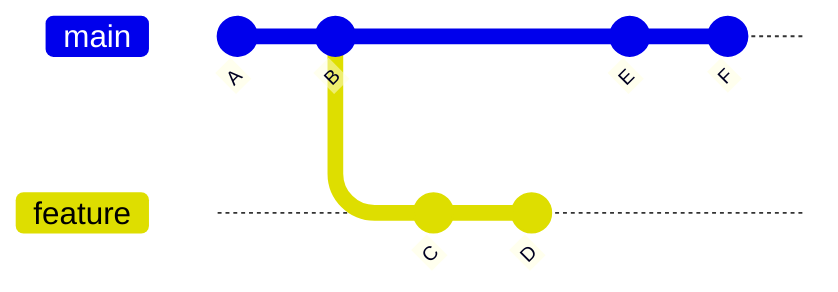
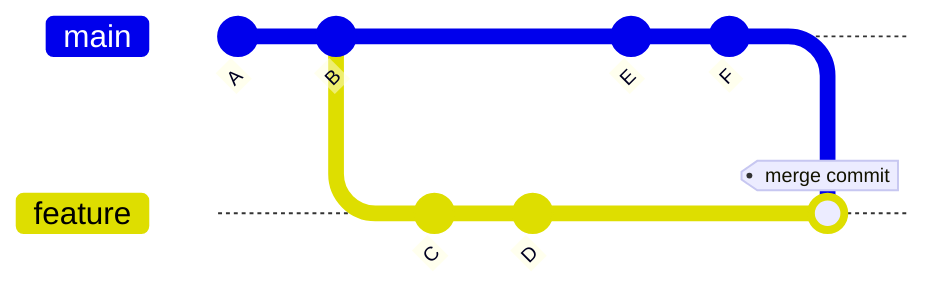
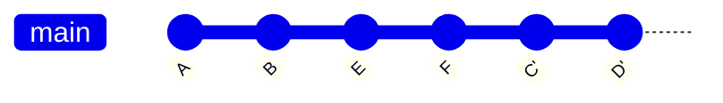
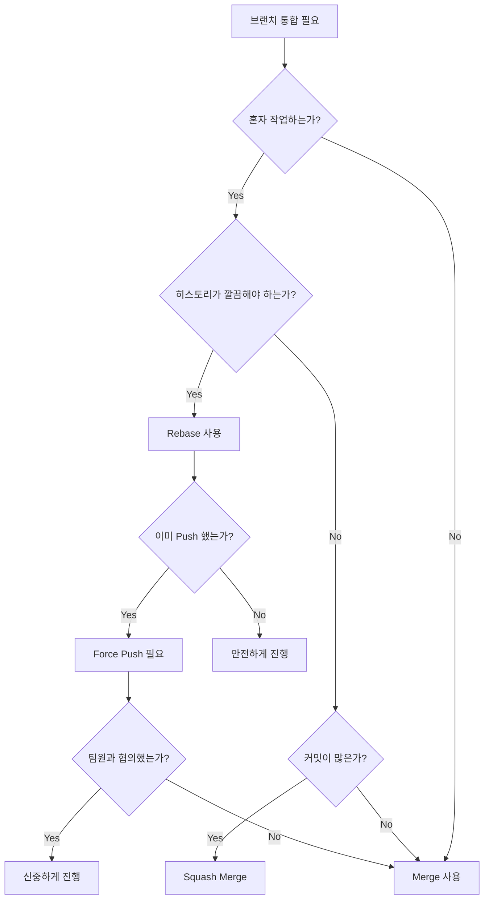

import { Tabs, TabItem } from '@astrojs/starlight/components';
import { Aside } from '@astrojs/starlight/components';
import { Code } from '@astrojs/starlight/components';

# Git Rebase: 커밋 히스토리를 재구성하는 강력한 도구

## 개요

Git rebase는 브랜치의 베이스를 변경하고 커밋 히스토리를 재구성하는 Git의 가장 강력한 기능 중 하나입니다. 올바르게 사용하면 깔끔한 프로젝트 히스토리를 유지할 수 있지만, 잘못 사용하면 팀 전체의 워크플로우를 망칠 수 있는 양날의 검입니다.

### 이 가이드에서 다루는 내용

- **Rebase의 핵심 개념**과 동작 원리
- **Merge vs Rebase**: 언제 무엇을 사용해야 하는가
- **Interactive Rebase**를 통한 커밋 히스토리 조작
- **실무 시나리오**별 rebase 활용법
- **위험 상황 대처법**과 복구 전략
- **팀 협업**을 위한 rebase 가이드라인

<Aside type="danger">
  **중요 경고**: Rebase는 커밋 히스토리를 다시 쓰는 작업입니다. 이미 공개된(pushed) 커밋에 대해 rebase를 수행하면 협업하는 팀원들에게 심각한 문제를 일으킬 수 있습니다.
</Aside>

## 핵심 개념 이해하기

### Rebase vs Merge: 근본적인 차이

두 명령어 모두 브랜치를 통합하지만, 접근 방식이 완전히 다릅니다:



#### Merge 방식
```bash
git checkout feature
git merge main
```



#### Rebase 방식
```bash
git checkout feature
git rebase main
```



<Aside type="note">
  Rebase 후 C와 D는 새로운 커밋 C'와 D'로 재생성됩니다. 커밋 해시가 변경되므로 기술적으로는 완전히 새로운 커밋입니다.
</Aside>

### Rebase의 동작 원리

Rebase는 내부적으로 다음과 같은 단계로 동작합니다:

1. **현재 브랜치의 커밋들을 임시 저장**
2. **HEAD를 대상 브랜치로 이동**
3. **저장한 커밋들을 순서대로 재적용**

<Code code={`# 내부 동작 시뮬레이션
git checkout feature
git reset --hard main        # HEAD를 main으로 이동
git cherry-pick C D          # 커밋들을 재적용`} lang="bash" />

## 기본 Rebase 사용법

### 1. 브랜치 Rebase

가장 일반적인 사용 사례는 feature 브랜치를 최신 main 브랜치에 맞추는 것입니다:

<Code code={`# feature 브랜치를 main의 최신 상태로 rebase
git checkout feature
git rebase main

# 또는 한 줄로
git rebase main feature`} lang="bash" />

### 2. 충돌 해결 워크플로우

Rebase 중 충돌이 발생하면:

<Code code={`# 1. 충돌 파일 확인
git status

# 2. 충돌 해결 후 스테이징
git add <resolved-files>

# 3. Rebase 계속
git rebase --continue

# 또는 중단하고 원래 상태로 복구
git rebase --abort

# 현재 커밋 건너뛰기 (주의!)
git rebase --skip`} lang="bash" />

<Aside type="tip">
  충돌 해결 시 `git status`를 자주 확인하세요. 어떤 파일이 충돌 상태인지, rebase가 어느 단계에 있는지 명확히 보여줍니다.
</Aside>

### 3. Upstream Rebase

Fork한 저장소를 원본과 동기화할 때:

<Code code={`# upstream 설정 (최초 1회)
git remote add upstream https://github.com/original/repo.git

# upstream 변경사항 가져오기
git fetch upstream

# 로컬 main을 upstream/main으로 rebase
git checkout main
git rebase upstream/main

# feature 브랜치도 업데이트
git checkout feature
git rebase main`} lang="bash" />

## Interactive Rebase 심화

Interactive rebase는 커밋 히스토리를 수술하듯 정밀하게 조작할 수 있는 강력한 도구입니다.

### 기본 명령어

<Code code={`# 최근 3개 커밋 수정
git rebase -i HEAD~3

# 특정 커밋 이후 모든 커밋 수정
git rebase -i <commit-hash>

# 브랜치 분기점부터 수정
git rebase -i main`} lang="bash" />

### Interactive 명령어 상세

편집기에서 사용할 수 있는 명령어들:

| 명령어 | 약어 | 설명 | 사용 예시 |
|--------|------|------|-----------|
| `pick` | `p` | 커밋 유지 | 기본값, 변경 없이 사용 |
| `reword` | `r` | 커밋 메시지만 수정 | 오타 수정, 메시지 개선 |
| `edit` | `e` | 커밋 내용 수정 | 파일 추가/삭제, 코드 변경 |
| `squash` | `s` | 이전 커밋과 합치기 | 여러 작은 커밋을 하나로 |
| `fixup` | `f` | squash와 동일하나 메시지 버림 | 임시 커밋 정리 |
| `drop` | `d` | 커밋 삭제 | 불필요한 커밋 제거 |
| `exec` | `x` | 쉘 명령 실행 | 테스트 실행, 빌드 확인 |

### 실전 예제

#### 1. 커밋 메시지 정리

<Code code={`# git rebase -i HEAD~3 실행 후
pick abc123 feat: Add user authentication
reword def456 fix: typo in login form  # 'typo' → 'Fix typo'
pick ghi789 feat: Add password reset`} lang="bash" />

#### 2. 여러 커밋을 하나로 합치기

<Code code={`# 작업 중 생성된 지저분한 커밋들
pick abc123 feat: Start implementing search
pick def456 WIP: search functionality
pick ghi789 fix typo
pick jkl012 finish search feature

# 정리 후
pick abc123 feat: Start implementing search
squash def456 WIP: search functionality
squash ghi789 fix typo
squash jkl012 finish search feature`} lang="bash" />

#### 3. 커밋 순서 변경 및 삭제

<Code code={`# 원본
pick abc123 feat: Add feature A
pick def456 debug: console.log statements
pick ghi789 feat: Add feature B

# 수정 후
pick abc123 feat: Add feature A
pick ghi789 feat: Add feature B
drop def456 debug: console.log statements`} lang="bash" />

<Aside type="caution">
  커밋 순서를 변경할 때는 의존성을 주의깊게 확인하세요. A 커밋이 B 커밋의 변경사항에 의존한다면, 순서를 바꿀 때 충돌이 발생할 수 있습니다.
</Aside>

## 고급 Rebase 기법

### 1. Autosquash를 활용한 스마트 정리

<Code code={`# fixup 커밋 생성
git commit --fixup=abc123

# squash 커밋 생성
git commit --squash=def456

# autosquash로 자동 정리
git rebase -i --autosquash main`} lang="bash" />

### 2. Rebase with Exec

각 커밋마다 테스트를 실행하여 빌드가 깨지지 않는지 확인:

<Code code={`# rebase 시작
git rebase -i main --exec "npm test"

# 편집기에서 자동으로 추가됨
pick abc123 feat: Add feature
exec npm test
pick def456 fix: Bug fix
exec npm test`} lang="bash" />

### 3. Preserve Merges

병합 커밋을 유지하면서 rebase:

<Code code={`# 기존 병합 구조 유지 (Git 2.18 이전)
git rebase --preserve-merges main

# Git 2.18 이상
git rebase --rebase-merges main`} lang="bash" />

## 실무 시나리오별 가이드

### 시나리오 1: Pull Request 전 히스토리 정리

<Tabs>
  <TabItem label="단계별 접근">
    ```bash
    # 1. 작업 브랜치 확인
    git log --oneline main..feature
    
    # 2. Interactive rebase 시작
    git rebase -i main
    
    # 3. 커밋 정리
    # - 관련 커밋들을 squash
    # - 커밋 메시지 개선
    # - 불필요한 커밋 제거
    
    # 4. 최종 확인
    git log --oneline --graph
    ```
  </TabItem>
  <TabItem label="자동화 스크립트">
    ```bash
    #!/bin/bash
    # cleanup-branch.sh
    
    BRANCH=$(git branch --show-current)
    BASE_BRANCH=${1:-main}
    
    echo "Cleaning up $BRANCH based on $BASE_BRANCH..."
    
    # 백업 브랜치 생성
    git branch "${BRANCH}-backup"
    
    # Interactive rebase
    git rebase -i "$BASE_BRANCH" --autosquash
    
    # 성공 여부 확인
    if [ $? -eq 0 ]; then
        echo "Cleanup successful!"
        echo "Backup saved as ${BRANCH}-backup"
    else
        echo "Rebase failed. Run 'git rebase --abort' to cancel"
    fi
    ```
  </TabItem>
</Tabs>

### 시나리오 2: 실수로 만든 커밋 수정

<Code code={`# 방금 만든 커밋에 파일 추가
git add forgotten-file.js
git commit --amend --no-edit

# 이전 커밋에 변경사항 추가
git add missing-changes.js
git commit --fixup HEAD~2
git rebase -i --autosquash HEAD~3`} lang="bash" />

### 시나리오 3: 다른 브랜치의 특정 커밋만 가져오기

<Code code={`# Cherry-pick을 활용한 선택적 rebase
git rebase --onto main feature~3 feature

# 특정 범위의 커밋만 rebase
git rebase --onto newbase oldbase feature`} lang="bash" />

## 위험 상황과 복구 전략

### 1. Rebase 후 Force Push

<Aside type="danger">
  Force push는 원격 저장소의 히스토리를 덮어씁니다. 팀원들과 충분히 소통한 후 사용하세요.
</Aside>

<Code code={`# 안전한 force push
git push --force-with-lease origin feature

# 일반 force push (주의!)
git push --force origin feature

# force-with-lease가 더 안전한 이유:
# 원격에 다른 변경사항이 있으면 거부됨`} lang="bash" />

### 2. 잘못된 Rebase 복구

<Tabs>
  <TabItem label="Reflog 활용">
    ```bash
    # reflog 확인
    git reflog
    
    # rebase 이전 상태 찾기
    # 예: abc123 HEAD@{5}: checkout: moving from feature to main
    
    # 복구
    git reset --hard HEAD@{5}
    ```
  </TabItem>
  <TabItem label="백업 브랜치">
    ```bash
    # rebase 전 백업 생성 (습관화 추천)
    git branch backup-feature
    
    # rebase 수행
    git rebase main
    
    # 문제 발생 시 복구
    git reset --hard backup-feature
    ```
  </TabItem>
</Tabs>

### 3. 공개된 브랜치 Rebase 수습

최악의 상황: 이미 push된 브랜치를 rebase했을 때

<Code code={`# 팀에게 즉시 알리고 다음 수행

# 옵션 1: revert the rebase
git reflog
git reset --hard <rebase-이전-commit>
git push --force-with-lease

# 옵션 2: 팀원들의 로컬 수정
# 각 팀원이 실행
git fetch origin
git rebase origin/feature  # 또는
git reset --hard origin/feature`} lang="bash" />

## 팀 협업 가이드라인

### Rebase 정책 수립

<Code code={`# .gitmessage 또는 README에 명시할 내용

## 우리 팀의 Rebase 규칙

### ✅ Rebase 사용 가능
- 아직 push하지 않은 로컬 커밋
- 자신만 작업하는 feature 브랜치
- PR 리뷰 전 히스토리 정리

### ❌ Rebase 금지
- main, develop 등 공용 브랜치
- 다른 사람과 공유 중인 브랜치
- 이미 PR이 열린 브랜치 (리뷰어와 협의 필요)

### 🔧 권장 워크플로우
1. feature 브랜치에서 작업
2. PR 생성 전 interactive rebase로 정리
3. main의 변경사항은 rebase로 통합
4. PR 머지는 squash merge 사용`} lang="markdown" />

### Git Hooks로 안전장치 구현

```bash title=".git/hooks/pre-rebase"
#!/bin/bash
# .git/hooks/pre-rebase

protected_branches="main|develop|release/*"
current_branch=$(git symbolic-ref HEAD | sed -e 's,.*/\(.*\),\1,')

if [[ "$current_branch" =~ $protected_branches ]]; then
    echo "⚠️  Rebase on protected branch '$current_branch' is not allowed!"
    echo "Please create a feature branch for your changes."
    exit 1
fi

# 원격에 존재하는지 확인
if git ls-remote --exit-code --heads origin "$current_branch" >/dev/null 2>&1; then
    echo "⚠️  Warning: Branch '$current_branch' exists on remote."
    echo "Rebase will rewrite history. Make sure to coordinate with your team!"
    read -p "Continue? (y/N) " -n 1 -r
    echo
    if [[ ! $REPLY =~ ^[Yy]$ ]]; then
        exit 1
    fi
fi
```

## Best Practices 체크리스트

### ✅ 항상 지켜야 할 원칙

- [ ] Rebase 전 현재 상태 백업 (브랜치 또는 태그)
- [ ] 공개된 브랜치는 rebase 하지 않기
- [ ] Interactive rebase는 의미 있는 단위로 커밋 정리
- [ ] Force push 시 `--force-with-lease` 사용
- [ ] 팀과 rebase 정책 공유 및 문서화

### 📊 Rebase vs Merge 의사결정 트리



## 실전 연습 문제

### 연습 1: 지저분한 히스토리 정리

<Code code={`# 연습용 저장소 생성
mkdir rebase-practice && cd rebase-practice
git init

# 지저분한 히스토리 생성
echo "initial" > file.txt && git add . && git commit -m "Initial commit"
echo "feature start" >> file.txt && git add . && git commit -m "WIP: feature"
echo "typo" >> file.txt && git add . && git commit -m "fix typu"
echo "more work" >> file.txt && git add . && git commit -m "more changes"
echo "done" >> file.txt && git add . && git commit -m "feature complete"

# 과제: 위 5개 커밋을 의미있는 2개 커밋으로 정리
# 힌트: git rebase -i HEAD~4`} lang="bash" />

### 연습 2: 충돌 해결 연습

<Code code={`# main 브랜치 설정
git checkout -b main
echo "main line 1" > conflict.txt
git add . && git commit -m "Main commit"

# feature 브랜치 생성
git checkout -b feature HEAD~1
echo "feature line 1" > conflict.txt
git add . && git commit -m "Feature commit"

# main에 추가 커밋
git checkout main
echo "main line 2" >> conflict.txt
git add . && git commit -m "Main update"

# rebase 시도 (충돌 발생)
git checkout feature
git rebase main

# 과제: 충돌을 해결하고 rebase 완료하기`} lang="bash" />

## 마무리

Git rebase는 강력한 도구이지만, 큰 힘에는 큰 책임이 따릅니다. 이 가이드의 핵심 교훈:

1. **로컬에서는 자유롭게, 원격에서는 신중하게**
2. **백업은 선택이 아닌 필수**
3. **팀과의 소통이 가장 중요**
4. **연습을 통해 자신감 쌓기**

<Aside type="tip">
  Rebase 마스터가 되는 가장 좋은 방법은 연습용 저장소에서 다양한 시나리오를 실험해보는 것입니다. 실수를 두려워하지 마세요. Reflog이 항상 당신을 구해줄 것입니다!
</Aside>

### 추가 학습 자료

- [Git 공식 문서 - Rebase](https://git-scm.com/book/en/v2/Git-Branching-Rebasing)
- [Atlassian Git Tutorial - Rebase](https://www.atlassian.com/git/tutorials/rewriting-history/git-rebase)
- [GitHub Flow와 Rebase 전략](https://docs.github.com/en/get-started/using-git/about-git-rebase)